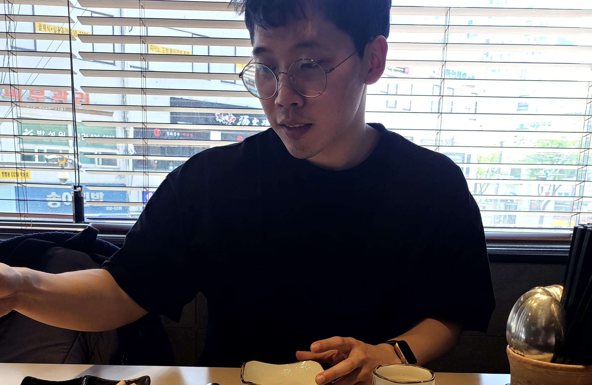

### U-keun Song
{: width="50%" height="50%"}
I'm a graduate student at Sungkyunkwan University and interseted in enumerative combinatorics.

Yay.

E-mail: sukeun319@gmail.com

### Papers
#### Preprints
- Negative moments of orthogonal polynomials (with Jihyeug Jang, Donghyun Kim, Jang Soo Kim, Minho Song), [arXiv:2201.11344](https://arxiv.org/abs/2201.11344)
- Refined canonical stable Grothendieck polynomials and their duals (with Byung-Hak Hwang, Jihyeug Jang, Jang Soo Kim, Minho Song), [arXiv:2104.04251](https://arxiv.org/abs/2104.04251)

#### Published
- Proof of Chapoton's Conjecture on Newton Polygons of $q$-Ehrhart Polynomials (with Jang Soo Kim), E-JC Volume 25, Issue 2 (2018). [Link](https://www.combinatorics.org/ojs/index.php/eljc/article/view/v25i2p51)

### Education
- Combined master's-Ph.D. Mathematics, Sungkyunkwan University, Mar. 2016 - present 
  - Advisor : [Jang Soo Kim](https://jangsookim.github.io/)
- B.S. Mathematics, Sungkyunkwan University, Mar. 2010 - Feb. 2016
